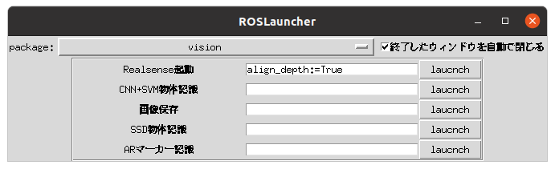

# ros_utils

ROSを利用するために作ったツール類

## インストール

```
cd ~/catkin_ws/src
git clone https://github.com/naka-lab/ros_utils.git
```

## launcher

rosノードを起動するGUIプログラム

- 準備
  - インストールされていなければgnome-terminalをインストール：`sudo apt-get install gnome-terminal`
  - lancherを起動するシェルスクリプトをわかりやすい場所にコピー：`cp ~/catkin_ws/src/ros_utils/scripts/launcher.sh ~/Desktop`または`cp ~/catkin_ws/src/ros_utils/scripts/launcher.sh ~/デスクトップ`

- 実行
  - コピーした`launcher.sh`をダブルクリックすると以下のようなGUIが起動する
  
  - 上部のプルダウンメニューでパッケージを選択
  - パッケージ内の各プログラムを`launch`ボタンで実行
  - 起動時にオプションを指定したい場合には，中央にあるエディットボックスにパラメータを記入

- launcherへのプログラムの追加
  - [`~/catkin_ws/src/ros_utils/scripts/launcher_settings.yaml`](scripts/launcher_settings.yaml)に以下の書式で追加するとGUIに反映される
  ```
  任意のパッケージ名:
  - name: 任意のコマンド名1
    command: 実行されるコマンド1
    option: コマンドのデフォルトオプション1（GUIから変更可能，省略可能）
  - name: 任意のコマンド名2
    command: 実行されるコマンド2
  ```

## param_setting_gui

ros paramを確認・設定可能なGUI

- 実行
```
rosrun ros_utils param_setting_gui.py
```

- 確認・設定したいパラメータが属しているnamespaceをプルダウンメニューから選択して，refreshボタンを押す
- 現在のパラメータが表示されるので，各パラメータを書き換えsetボタンを押すと，パラメータが変更される
